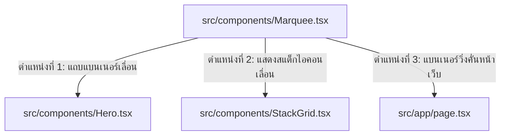

# Project Content Update Summary & Marquee Integration (สรุปแนวทางการอัปเดตและวิเคราะห์การใช้ Marquee)

รายงานฉบับนี้วิเคราะห์ระบบข้อมูลของโปรเจกต์และตรวจสอบความเหมาะสมในการนำส่วนประกอบ **`Marquee`** ที่ทำงานด้วย `requestAnimationFrame` และ `useAnimationFrame` เข้ามาประกอบใช้งานในระบบเว็บ Next.js แบบ Client Component

---

## 📂 1. แผนที่สถาปัตยกรรมและการแทรกส่วนประกอบ (Marquee Insertion Points)

เราวิเคราะห์จุดที่เหมาะสมในการนำคอมโพเนนต์ `Marquee` ตัวใหม่เข้ามาใช้งานร่วมกับโครงสร้างปัจจุบันได้ 3 ตำแหน่งหลักดังนี้:

### 1.1 จุดเชื่อมต่อการติดตั้งไฟล์ (File Registration Point)
*   **สร้างไฟล์ใหม่ที่**: `src/components/Marquee.tsx` โดยใช้ประเภทพร็อพ (Props): `MarqueeProps` สำหรับตั้งค่าความเร็ว (`speed`), การหยุดเมื่อชี้เมาส์ (`pauseOnHover`), ทิศทาง (`reverse`/`vertical`), และข้อมูลภายใน (`children`)

---

## ⚙️ 2. ผลการวิเคราะห์โค้ด Marquee (Code Static Audit)

*   **คุณสมบัติ**:
    *   ใช้การทำอนิเมชันแบบ 60fps ผ่านคำสั่งลูปเฟรมภาพหน้าต่างเบราว์เซอร์ `requestAnimationFrame`
    *   หลีกเลี่ยงกระบวนการกระตุก (Layout Thrashing) โดยคำนวณระยะขยับ `delta` (เวลาต่างระหว่างเฟรม) มาคำนวณการเลื่อน ทำให้แอนิเมชันมีความลื่นไหลสม่ำเสมอในทุกความแรงของคอมพิวเตอร์
*   **โครงสร้าง Component**:
    *   บังคับรันผ่าน Client Side Browser (`"use client";`) เนื่องจากมีการดึงค่าจาก Web API ได้แก่ `window.getComputedStyle`, `offsetHeight`, `offsetWidth`, และ `requestAnimationFrame`
