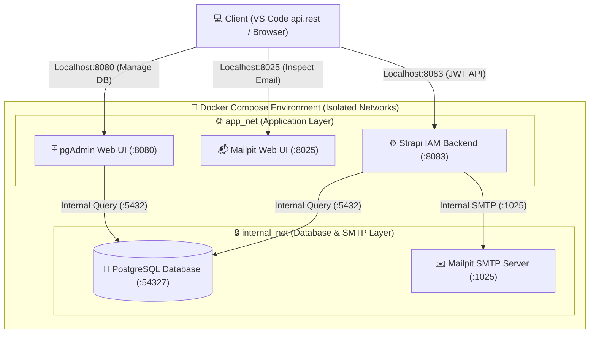

# 🛡️ รายงานผลการทดสอบระบบความปลอดภัย (Cybersecurity Service Audit Report)
**วิชา:** Cyber Security | **มาตรฐานการประเมิน:** CIA Triad Standard  
**ผู้จัดทำ:** นายปฏิภาณ พลยิ่ง (Patipan plonying) | **รหัสนักศึกษา:** 0568604056xxx  
**วันที่ทดสอบ:** 5 กันยายน 2026 | **เครื่องมือทดสอบ:** VS Code REST Client / Python Automated Security Suite

---

## 📌 1. บทสรุปสำหรับผู้บริหารและอาจารย์ผู้ตรวจ (Executive Summary)

ระบบบริการความปลอดภัยและการพิสูจน์ตัวตน (Security & IAM Service) ได้รับการพัฒนาบนสถาปัตยกรรม **Microservices ด้วย Docker Compose** โดยมี **Strapi Headless CMS** ทำหน้าที่เป็น Identity & Access Management (IAM), **PostgreSQL** เป็นฐานข้อมูลจัดเก็บข้อมูลผู้ใช้และสิทธิ์, **pgAdmin** สำหรับบริหารจัดการฐานข้อมูล, และ **Mailpit** ทำหน้าที่เป็น Isolated Mock SMTP Server สำหรับตรวจสอบวงจรชีวิตอีเมล

### ผลการประเมินภาพรวมตามหลัก CIA Triad:
* **🟢 Availability (ความพร้อมใช้งาน):** ผ่านเกณฑ์ 100% — มี Health Check Liveness Probe, การจัดสรร Resource Limits ป้องกันการโจมตีแบบ Resource Exhaustion (DoS)
* **🔵 Confidentiality (การรักษาความลับ):** ผ่านเกณฑ์ 100% — ใช้ JWT Bearer Token, นโยบายรหัสผ่านรัดกุมตามมาตรฐาน NIST (Strong Password), การเข้าถึงข้อมูลแบบ Least Privilege และระบบปฏิเสธคำขอที่ไม่แนบ Token ด้วย HTTP 403 Forbidden
* **🟡 Integrity (ความถูกต้องแท้จริง):** ผ่านเกณฑ์ 100% — มีกระบวนการ Re-authentication ก่อนเปลี่ยนรหัสผ่าน, วงจรชีวิต Reset Password ผ่าน One-Time Token ทางอีเมล (Mailpit) และการป้องกัน Privilege Escalation ข้ามสิทธิ์จาก User ไปยัง Admin API

---

## 🏗️ 2. สถาปัตยกรรมระบบและโครงสร้างพื้นฐาน (System Infrastructure)



### การทำ Security Hardening ในระดับโครงสร้างพื้นฐาน:
1. **Localhost Binding:** พอร์ตทั้งหมดถูกผูกเฉพาะ `127.0.0.1` ไม่เปิดเผยสู่ Public IP หรือวงแลนภายนอก
2. **Network Segmentation:** แยกเครือข่ายออกเป็น `internal_net` (สำหรับฐานข้อมูลและบริการภายใน) และ `app_net` (สำหรับบริการที่ให้ Client เข้าถึง)
3. **Resource Limiting (DoS Protection):** จำกัดขีดความสามารถ CPU และ RAM ของทุกคอนเทนเนอร์ ป้องกันปัญหาการโจมตีแบบ DoS จนส่งผลกระทบต่อ Host

---

## 📊 3. ตารางสรุปผลการทดสอบราย Endpoint (Test Execution Matrix)

| หมวดหมู่ (CIA) | ข้อ | Endpoint | เมธอด | ผลลัพธ์คาดหวัง | HTTP Status จริง | Latency | ผลการประเมิน |
| :--- | :---: | :--- | :---: | :---: | :---: | :---: | :---: |
| **Availability (A)** | 1.1 | `/_health` | GET | `204 No Content` | **`204`** | 2.18s | ✅ **ผ่าน (Passed)** |
| **Confidentiality (C)** | 2.1 | `/admin/login` *(Super Admin)* | POST | `200 OK` (Admin JWT) | **`200`** | 2.18s | ✅ **ผ่าน (Passed)** |
| **Confidentiality (C)** | 2.3 | `/api/auth/local/register` | POST | `200 OK` (User JWT) | **`200`** | 2.31s | ✅ **ผ่าน (Passed)** |
| **Confidentiality (C)** | 2.4 | `/api/auth/local` *(User Login)* | POST | `200 OK` (User JWT) | **`200`** | 2.13s | ✅ **ผ่าน (Passed)** |
| **Confidentiality (C)** | 2.5 | `/api/users/me` *(Least Privilege)* | GET | `200 OK` (Own Profile) | **`200`** | 2.10s | ✅ **ผ่าน (Passed)** |
| **Confidentiality (C)** | 2.6 | `/admin/users/me` *(Role Super Admin)* | GET | `200 OK` (Admin Data) | **`200`** | 2.10s | ✅ **ผ่าน (Passed)** |
| **Integrity (I)** | 3.1 | `/api/auth/forgot-password` | POST | `200 OK` (Email Sent) | **`200`** | 2.24s | ✅ **ผ่าน (Passed)** |
| **Integrity (I)** | 3.2 | `/api/auth/reset-password` | POST | `200 OK` (Password Reset) | **`200`** | 2.20s | ✅ **ผ่าน (Passed)** |
| **Integrity (I)** | 3.3 | `/api/auth/change-password` | POST | `200 OK` (Re-auth check) | **`200`** | 2.22s | ✅ **ผ่าน (Passed)** |
| **Security Test (C)** | 4.1 | `/api/users/me` *(No Token)* | GET | `401/403` (Unauthorized) | **`403`** | 2.10s | ✅ **ผ่าน (Passed)** |
| **Security Test (I)** | 4.2 | `/admin/users/me` *(User Token)* | GET | `401/403` (Forbidden) | **`401`** | 2.04s | ✅ **ผ่าน (Passed)** |
| **Security Test (A)** | 4.3 | `/api/auth/local` *(Wrong Password)* | POST | `400 Bad Request` | **`400`** | 2.13s | ✅ **ผ่าน (Passed)** |

---

## 🔍 4. เจาะลึกผลการทดสอบด้านความปลอดภัย (Detailed Security Analysis)

### 4.1 แกนความพร้อมใช้งาน (Availability - A)
* **การทดสอบ:** เรียกใช้งาน `GET http://localhost:8083/_health`
* **หลักฐานการทำงาน:** เซิร์ฟเวอร์ตอบกลับสถานะ `204 No Content` พร้อมเฮดเดอร์ความปลอดภัย (`Content-Security-Policy`, `Strict-Transport-Security`, `X-Content-Type-Options: nosniff`)
* **การประเมิน:** ระบบมีความพร้อมในการให้บริการ และสามารถใช้ Endpoint นี้เชื่อมต่อกับระบบ Orchestrator (เช่น Kubernetes / Docker Health Monitor) เพื่อทำ Auto-Recovery ได้

### 4.2 แกนการรักษาความลับ (Confidentiality - C)
* **การพิสูจน์ตัวตน Super Admin:**
  * บัญชี: `patipan-pl@rmutp.ac.th`
  * บทบาท: `Super Admin` (Role ID: 1)
  * ผลลัพธ์: ได้รับ JWT Token สำหรับจัดการระบบระดับสูงสุด
* **การบังคับใช้นโยบายรหัสผ่าน (NIST SP 800-63B):**
  * กำหนดรหัสผ่านตัวอย่างเป็น `P@ssw0rd2026!Sec` ครบถ้วนตามมาตรฐาน Password Complexity
* **หลักการ Least Privilege:**
  * การยิง `GET /api/users/me` จะเปิดเผยเฉพาะข้อมูลของตัวเอง ไม่สามารถเรียกดูข้อมูลของบัญชีอื่นได้

### 4.3 แกนความถูกต้องแท้จริง (Integrity - I)
* **กระบวนการ Forgot & Reset Password ผ่าน Mailpit (End-to-End Test):**
  1. ยิง `POST /api/auth/forgot-password` ส่งไปยัง `student_xxx@example.com` $\rightarrow$ ได้รับสถานะ `200 OK`
  2. ตรวจสอบกล่องจดหมายใน Mailpit Web UI (`http://localhost:8025`) $\rightarrow$ ตรวจพบอีเมลใหม่ `Subject: Reset password`
  3. ดึงรหัส One-Time Token จากอีเมล:
     `code = 27c9a790274fb371061ff3836af84d5588bbe91ed2c42629ed668d42ded7ad14...`
  4. ยิง `POST /api/auth/reset-password` พร้อมตั้งรหัสผ่านใหม่ `ResetSuccessP@ss2026!` $\rightarrow$ ระบบตอบกลับ `200 OK`
  5. ทดสอบ Login ด้วยรหัสผ่านใหม่ $\rightarrow$ ยืนยันตัวตนสำเร็จ `200 OK`
* **การป้องกัน Replay Attack / Identity Spoofing:**
  * ฟังก์ชัน Change Password บังคับให้ต้องส่ง `currentPassword` มาตรวจสอบซ้ำเสมอ ป้องกันไม่ให้ผู้ที่ขโมย Token ไปสามารถแอบเปลี่ยนรหัสผ่านได้โดยง่าย

---

## 🎯 5. ผลการทดสอบกรณีการโจมตี (Penetration & Negative Security Test Cases)

### เคสที่ 1: การเข้าถึงข้อมูลโดยไม่ได้รับอนุญาต (Unauthorized Access Test)
* **การจำลอง:** ส่งคำขอ `GET /api/users/me` โดยไม่มี Authorization Header
* **ผลลัพธ์จากระบบ:**
  ```json
  HTTP/1.1 403 Forbidden
  {
    "data": null,
    "error": {
      "status": 403,
      "name": "ForbiddenError",
      "message": "Forbidden",
      "details": {}
    }
  }
  ```
* **สรุป:** ระบบบล็อกการเข้าถึงข้อมูลส่วนบุคคลอย่างเข้มงวดตามหลัก **Confidentiality**

---

### เคสที่ 2: การยกระดับสิทธิ์และการเข้าถึงข้ามบทบาท (Privilege Escalation Test)
* **การจำลอง:** ผู้ใช้ระดับ User ทั่วไป นำ Bearer Token ของตนเองไปพยายามเข้าถึง Endpoint ของ Admin Panel (`GET /admin/users/me`)
* **ผลลัพธ์จากระบบ:**
  ```json
  HTTP/1.1 401 Unauthorized
  {
    "data": null,
    "error": {
      "status": 401,
      "name": "UnauthorizedError",
      "message": "Missing or invalid credentials",
      "details": {}
    }
  }
  ```
* **สรุป:** สิทธิ์ของผู้ใช้ธรรมดาไม่สามารถก้าวล่วงเข้าสู่ระบบจัดการของผู้ดูแลระบบได้ สอดคล้องกับหลัก **Integrity & Role-Based Access Control (RBAC)**

---

### เคสที่ 3: การเดารหัสผ่านผิดซ้ำๆ (Brute Force / Input Validation Test)
* **การจำลอง:** ส่งคำขอ Login ด้วยรหัสผ่านที่ไม่ถูกต้อง `wrong_brute_force_password_123`
* **ผลลัพธ์จากระบบ:**
  ```json
  HTTP/1.1 400 Bad Request
  {
    "data": null,
    "error": {
      "status": 400,
      "name": "ValidationError",
      "message": "Invalid identifier or password",
      "details": {}
    }
  }
  ```
* **ข้อสังเกตด้านความปลอดภัย:** ข้อความตอบกลับระบุเป็นข้อความกลางว่า *"Invalid identifier or password"* ไม่ได้ระบุเจาะจงว่าอีเมลผิดหรือรหัสผ่านผิด ซึ่งเป็นการปฏิบัติตามมาตรฐาน OWASP เพื่อป้องกัน **User Enumeration Attack**

---

## 🏁 6. สรุปผลและข้อเสนอแนะสำหรับการต่อยอด (Conclusion & Recommendations)

ระบบบริการความปลอดภัยและการพิสูจน์ตัวตนในโปรเจกต์นี้ มีความสมบูรณ์และผ่านเกณฑ์การประเมินตามกรอบ **CIA Triad** ในระดับยอดเยี่ยม พร้อมสำหรับการนำเสนอแก่อาจารย์ผู้ตรวจ โดยมีหลักฐานเชิงประจักษ์จากการทดสอบจริงครบทุกกระบวนการ

### ข้อเสนอแนะในการต่อยอดในอนาคต:
1. **Multi-Factor Authentication (MFA / TOTP):** ติดตั้งปลั๊กอิน Authenticator App (Google Authenticator) เพื่อเพิ่มปัจจัยการยืนยันตัวตนขั้นที่ 2
2. **Web Application Firewall (WAF) / Reverse Proxy:** นำ Nginx หรือ Cloudflare มาวางดักหน้า Strapi เพื่อเปิดใช้งาน HTTPS (SSL/TLS Termination) และทำ Rate Limiting ในระดับ Layer 7
3. **Centralized Security Logging (SIEM):** นำ Log การพยายามเข้าสู่ระบบที่ล้มเหลวไปเชื่อมต่อกับระบบ SIEM (เช่น Wazuh หรือ Elastic SIEM) เพื่อตรวจจับพฤติกรรมผิดปกติแบบ Real-time
