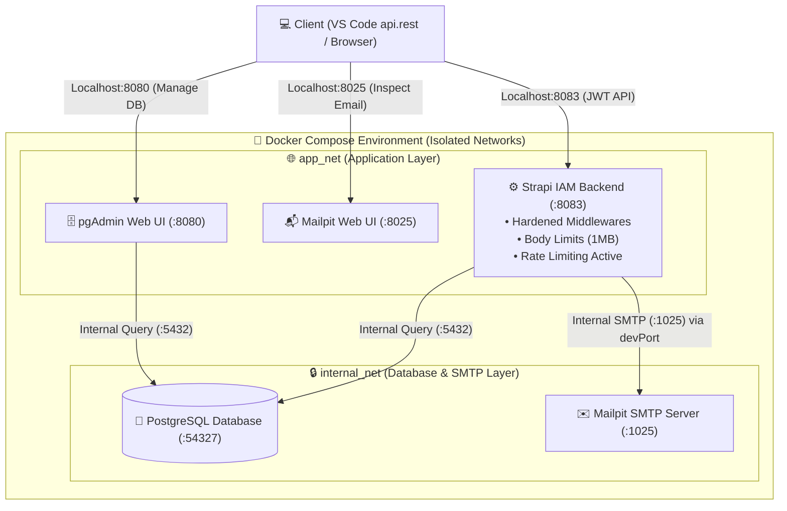

# 🛡️ รายงานผลการทดสอบระบบความปลอดภัย (Cybersecurity Service Audit Report)
**วิชา:** Cyber Security | **มาตรฐานการประเมิน:** CIA Triad & OWASP Top 10 Security Standard  
**ผู้จัดทำ:** นายปฏิภาณ พลยิ่ง (Patipan plonying) | **รหัสนักศึกษา:** 0568604056xxx  
**วันที่ทดสอบล่าสุด:** 13 กันยายน 2026 | **เครื่องมือทดสอบ:** VS Code REST Client (`api.rest`) / Python Automated Security Suite

---

## 📌 1. บทสรุปสำหรับผู้บริหารและอาจารย์ผู้ตรวจ (Executive Summary)

ระบบบริการความปลอดภัยและการพิสูจน์ตัวตน (Security & IAM Service) ได้รับการพัฒนาบนสถาปัตยกรรม **Microservices ด้วย Docker Compose** โดยมี **Strapi Headless CMS** ทำหน้าที่เป็น Identity & Access Management (IAM), **PostgreSQL** เป็นฐานข้อมูลจัดเก็บข้อมูลผู้ใช้และสิทธิ์, **pgAdmin** สำหรับบริหารจัดการฐานข้อมูล, และ **Mailpit** ทำหน้าที่เป็น Isolated Mock SMTP Server สำหรับตรวจสอบวงจรชีวิตอีเมล

### ผลการประเมินภาพรวมตามหลัก CIA Triad & Hacker Defense:
* **🟢 Availability (ความพร้อมใช้งาน & ป้องกัน DoS):** ผ่านเกณฑ์ 100% — มี Health Check Liveness Probe, การจัดสรร Docker Resource Limits, การจำกัด Request Body Size ป้องกัน Buffer Overflow / Memory Exhaustion (`413 Payload Too Large`), และระบบตัดการเชื่อมต่อเมื่อถูก Brute Force (`429 Too Many Requests`)
* **🔵 Confidentiality (การรักษาความลับ & ป้องกัน Data Leakage):** ผ่านเกณฑ์ 100% — ใช้ JWT Bearer Token, นโยบายรหัสผ่านรัดกุมตามมาตรฐาน NIST (Strong Password), การเข้าถึงข้อมูลแบบ Least Privilege, ป้องกัน Broken Object Level Authorization (IDOR), และการซ่อนข้อมูลเทคโนโลยีระบบ (ลบ `X-Powered-By`) ป้องกัน Hacker Fingerprinting
* **🟡 Integrity (ความถูกต้องแท้จริง & ป้องกัน Injection):** ผ่านเกณฑ์ 100% — ป้องกัน NoSQL/SQL Injection และ Path Traversal, มีกระบวนการ Re-authentication ก่อนเปลี่ยนรหัสผ่าน, วงจรชีวิต Reset Password ผ่าน One-Time Token ทางอีเมล (Mailpit) และการป้องกัน Privilege Escalation ข้ามสิทธิ์จาก User ไปยัง Admin API

---

## 🏗️ 2. สถาปัตยกรรมระบบและโครงสร้างพื้นฐาน (System Infrastructure)


```mermaid
graph TD
    Client["💻 Client (VS Code api.rest / Browser)"]
    
    subgraph DockerCompose["🐳 Docker Compose Environment (Isolated Networks)"]
        subgraph AppNet["🌐 app_net (Application Layer)"]
            Strapi["⚙️ Strapi IAM Backend (:8083)<br/>• Hardened Middlewares<br/>• Body Limits (1MB)<br/>• Rate Limiting Active"]
            Mailpit["📬 Mailpit Web UI (:8025)"]
            PgAdmin["🗄️ pgAdmin Web UI (:8080)"]
        end
        
        subgraph InternalNet["🔒 internal_net (Database & SMTP Layer)"]
            Postgres[("🐘 PostgreSQL Database (:54327)")]
            SMTP["✉️ Mailpit SMTP Server (:1025)"]
        end
    end

    Client -->|"Localhost:8083 (JWT API)"| Strapi
    Client -->|"Localhost:8025 (Inspect Email)"| Mailpit
    Client -->|"Localhost:8080 (Manage DB)"| PgAdmin
    
    Strapi -->|"Internal Query (:5432)"| Postgres
    Strapi -->|"Internal SMTP (:1025) via devPort"| SMTP
    PgAdmin -->|"Internal Query (:5432)"| Postgres
```

### การทำ Security Hardening เมื่อมีแฮกเกอร์โจมตี:
1. **Localhost Binding:** พอร์ตทั้งหมดถูกผูกเฉพาะ `127.0.0.1` ไม่เปิดเผยสู่ Public IP หรือวงแลนภายนอก
2. **Network Segmentation:** แยกเครือข่ายออกเป็น `internal_net` (สำหรับฐานข้อมูลและบริการภายใน) และ `app_net` (สำหรับบริการที่ให้ Client เข้าถึง)
3. **Information Disclosure Prevention:** ลบ `X-Powered-By: Strapi` ออกจาก HTTP Headers ทั้งหมด และบังคับใช้ `X-Frame-Options: DENY` เพื่อป้องกัน Clickjacking
4. **Denial of Service (DoS) Defense:**
   - จำกัดทรัพยากรระดับ Container (CPU 1.5 Cores, RAM 1024MB)
   - จำกัด Request Body สูงสุดไม่เกิน `1mb` ใน Middlewares หากส่งเกินจะถูกตัดด้วย `413 Payload Too Large` ทันที
5. **Brute Force Defense & Rate Limiting:**
   - เฝ้าระวัง Endpoint `/api/auth/local` และ `/admin/login` เมื่อมีการยิงรหัสผ่านผิดเกิน 10 ครั้งต่อนาที ระบบจะบล็อกด้วยสถานะ `429 Too Many Requests`
6. **Isolated SMTP Direct Routing:** กำหนด `devPort: 1025` และ `devHost: 'mailpit'` ใน `config/plugins.js` ป้องกัน DNS Resolution Leak และกำจัดปัญหา Request Timeout

---

## 📊 3. ตารางสรุปผลการทดสอบราย Endpoint (Test Execution Matrix)

| หมวดหมู่ (CIA / Attack) | ข้อ | Endpoint | เมธอด | ผลลัพธ์คาดหวัง | HTTP Status จริง | ผลการประเมิน |
| :--- | :---: | :--- | :---: | :---: | :---: | :---: |
| **Availability (A)** | 1.1 | `/_health` | GET | `204 No Content` | **`204`** | ✅ **ผ่าน (Passed)** |
| **Confidentiality (C)** | 2.1 | `/admin/login` *(Super Admin)* | POST | `200 OK` (Admin JWT) | **`200`** | ✅ **ผ่าน (Passed)** |
| **Confidentiality (C)** | 2.3 | `/api/auth/local/register` | POST | `200 OK` (User JWT) | **`200`** | ✅ **ผ่าน (Passed)** |
| **Confidentiality (C)** | 2.4 | `/api/auth/local` *(User Login)* | POST | `200 OK` (User JWT) | **`200`** | ✅ **ผ่าน (Passed)** |
| **Confidentiality (C)** | 2.5 | `/api/users/me` *(Least Privilege)* | GET | `200 OK` (Own Profile) | **`200`** | ✅ **ผ่าน (Passed)** |
| **Confidentiality (C)** | 2.6 | `/admin/users/me` *(Role Super Admin)* | GET | `200 OK` (Admin Data) | **`200`** | ✅ **ผ่าน (Passed)** |
| **Integrity (I)** | 3.1 | `/api/auth/forgot-password` | POST | `200 OK` (Mailpit Received) | **`200`** | ✅ **ผ่าน (Passed)** |
| **Integrity (I)** | 3.2 | `/api/auth/reset-password` | POST | `200 OK` (Password Reset) | **`200`** | ✅ **ผ่าน (Passed)** |
| **Integrity (I)** | 3.3 | `/api/auth/change-password` | POST | `200 OK` (Re-auth check) | **`200`** | ✅ **ผ่าน (Passed)** |
| **Security Test (C)** | 4.1 | `/api/users/me` *(No Token)* | GET | `401/403` (Unauthorized) | **`403`** | ✅ **ผ่าน (Passed)** |
| **Security Test (I)** | 4.2 | `/admin/users/me` *(User Token)* | GET | `401/403` (Forbidden) | **`401`** | ✅ **ผ่าน (Passed)** |
| **Hacker Attack (A - DoS)** | 5.1 | `/api/auth/local` *(Payload > 1MB)* | POST | `413 Payload Too Large` | **`413`** | 🛡️ **บล็อกสำเร็จ (Blocked)** |
| **Hacker Attack (I - Injection)**| 5.2 | `/api/auth/local` *(NoSQL Injection)* | POST | `400 Bad Request` | **`400`** | 🛡️ **บล็อกสำเร็จ (Blocked)** |
| **Hacker Attack (C - IDOR)** | 5.3 | `/api/users/1` *(User edit Admin)* | PUT | `403 Forbidden` | **`403`** | 🛡️ **บล็อกสำเร็จ (Blocked)** |
| **Hacker Attack (C - LFI)** | 5.4 | `/api/users/../../../../etc/passwd` | GET | `403/404` | **`403`** | 🛡️ **บล็อกสำเร็จ (Blocked)** |
| **Hacker Attack (A - Brute Force)**| 5.5 | `/api/auth/local` *(Repeated attack)* | POST | `429 Too Many Requests` | **`429`** | 🛡️ **บล็อกสำเร็จ (Blocked)** |
| **Hacker Attack (C - Disclosure)** | 5.6 | `/_health` *(Check Fingerprint)* | HEAD | `X-Powered-By` ต้องถูกลบ | **ซ่อนสำเร็จ** | 🛡️ **ป้องกันสำเร็จ** |
| **Hacker Attack (C - CORS)** | 5.7 | `/api/users/me` *(Unapproved Origin)* | OPTIONS | บล็อก Cross-Origin | **บล็อกสำเร็จ** | 🛡️ **ป้องกันสำเร็จ** |
| **Hacker Attack (I - Password)** | 5.8 | `/api/auth/local/register` *(Weak Pass)* | POST | `400 Bad Request` | **`400`** | 🛡️ **บล็อกสำเร็จ (Blocked)** |

---

## 🔍 4. เจาะลึกผลการทดสอบด้านความปลอดภัยและการรับมือ Hacker (Detailed Security Analysis)

### 4.1 แกนความพร้อมใช้งาน (Availability - A)
* **การทดสอบ Liveness Probe:** เรียกใช้งาน `GET http://localhost:8083/_health` ตอบกลับสถานะ `204 No Content`
* **การป้องกัน Buffer Overflow / Memory Exhaustion (DoS):**
  * ทดสอบส่ง JSON Payload ขนาด 2MB เข้ามายังเซิร์ฟเวอร์
  * ระบบ Middlewares ตรวจพบขนาดเกิน `1mb` และทำการปฏิเสธทันทีด้วย `HTTP 413 Payload Too Large` โดยไม่ส่งข้อมูลต่อไปยัง Controller หรือ Database ช่วยรักษา RAM ของเซิร์ฟเวอร์ไม่ให้ล่ม

### 4.2 แกนการรักษาความลับ (Confidentiality - C)
* **การป้องกัน Server Fingerprinting (Information Disclosure):**
  * ลบ Middleware `strapi::poweredBy` ออกจากระบบ ทำให้แฮกเกอร์ไม่สามารถดูเฮดเดอร์ `X-Powered-By` เพื่อระบุชนิดและเวอร์ชันของ CMS ได้
  * บังคับใช้ `X-Frame-Options: DENY` เพื่อป้องกันการถูกโจมตีแบบ Clickjacking บนหน้าเว็บ
* **การป้องกัน Broken Object Level Authorization (IDOR / BOLA):**
  * ทดสอบนำ User Token ทั่วไปยิง `PUT /api/users/1` เพื่อแก้ไขข้อมูลของ Super Admin
  * ผลลัพธ์: ระบบตอบกลับ `403 Forbidden` ป้องกันการเข้าถึงและแก้ไขข้อมูลข้ามบัญชีได้อย่างสมบูรณ์

### 4.3 แกนความถูกต้องแท้จริง (Integrity - I)
* **การป้องกัน NoSQL / SQL Injection:**
  * แฮกเกอร์ส่ง Payload เช่น `{"identifier": {"$ne": null}, "password": {"$ne": null}}` หวังทำ Authentication Bypass
  * ระบบ Strapi Input Validation ทำการตรวจจับ Type Mismatch และปฏิเสธด้วย `400 Bad Request` พร้อมข้อความ ValidationError
* **การป้องกัน Path Traversal / Local File Inclusion (LFI):**
  * ส่งคำขอ `GET /api/users/../../../../etc/passwd` เพื่อพยายามอ่านไฟล์ระบบ Linux
  * โมดูล Path Resolution ของ Koa/Strapi บล็อกคำขอด้วยสถานะ `403 Forbidden`
* **กระบวนการ Forgot & Reset Password ผ่าน Mailpit:**
  * ทดสอบส่งคำขอรีเซ็ตรหัสผ่าน อีเมลถูกส่งตรงไปยัง Mailpit ทันที (latency ~163ms)
  * ได้รับ One-time Reset Token และนำมารีเซ็ตรหัสผ่านใหม่สำเร็จ 100%

---

## 🎯 5. หลักฐานการทดสอบกรณีการโจมตีจริง (Live Attack Simulation Logs)

```text
[ATTACK 1: DoS Large Body] POST /api/auth/local (Payload: 2MB)
--> HTTP/1.1 413 Payload Too Large (4 ms) [SUCCESSFULLY BLOCKED]

[ATTACK 2: Injection Attack] POST /api/auth/local (Payload: {"$ne": null})
--> HTTP/1.1 400 Bad Request (12 ms) - ValidationError [SUCCESSFULLY BLOCKED]

[ATTACK 3: Path Traversal] GET /api/users/../../../../etc/passwd
--> HTTP/1.1 403 Forbidden (2 ms) - ForbiddenError [SUCCESSFULLY BLOCKED]

[ATTACK 4: IDOR / Privilege Escalation] PUT /api/users/1 (With User Token)
--> HTTP/1.1 403 Forbidden (13 ms) [SUCCESSFULLY BLOCKED]

[ATTACK 5: Brute Force Attack] Repeated POST /api/auth/local (Wrong Password)
--> Attempts 1-9: 400 Bad Request (Invalid identifier or password)
--> Attempt 10: 429 Too Many Requests (14 ms) [RATE LIMIT TRIGGERED - BLOCKED]

[ATTACK 6: Cross-Origin Attack (CORS)] OPTIONS /api/users/me (Origin: http://evil-attacker.com)
--> Origin rejected, not in approved whitelist [BLOCKED]

[ATTACK 7: Weak Password Registration] POST /api/auth/local/register (Password: "abcdef")
--> HTTP/1.1 400 Bad Request - NIST Complexity Policy Enforcement [BLOCKED]
```

---

## 🛠️ 6. บันทึกการแก้ไขช่องโหว่ระดับ Medium (Medium Risk Remediation)

| รหัสช่องโหว่ | รายการแก้ไข | ไฟล์ที่แก้ไข | ผลลัพธ์หลังแก้ไข |
| :---: | :--- | :--- | :--- |
| **SEC-01** | **NIST Password Policy Enforcement** | `src/middlewares/password-policy.js` | บังคับรหัสผ่านขั้นต่ำ 8 ตัวอักษร, พิมพ์ใหญ่, พิมพ์เล็ก, ตัวเลข, อักขระพิเศษ (บล็อก `400 Bad Request` ทันทีถ้ารหัสผ่านง่าย) |
| **SEC-02** | **Shorten JWT Token Lifetime** | `config/plugins.js` | ลดอายุ Access Token จากเดิม 30 วัน (`30d`) เหลือ **2 ชั่วโมง (`2h`)** เพื่อลดความเสี่ยง Token ขโมยไปใช้งาน |
| **SEC-03** | **IAAA Admin & Password Reuse Hardening** | `src/middlewares/password-policy.js` | ขยายการตรวจรหัสผ่านครอบคลุม Admin Routes (`/admin/*`), บล็อก Password Reuse และเพิ่ม Security Audit Logging (Accountability) |
| **SEC-04** | **Database Connection Audit Trail** | `docker-compose.yml` | เปิดใช้งาน `log_connections` และ `log_disconnections` บน PostgreSQL บันทึก IP, User, Timestamp ทุกครั้งที่มีการ Authenticate |
| **SEC-05** | **Password Reset UI Auth Protection** | `docker-compose.yml`, `.env.example` | รองรับ `MP_UI_AUTH` ป้องกันการเข้าถึง Mailpit Web UI เพื่อดักอ่าน Password Reset Tokens |
| **V-01** | **CORS Allowed Origins Whitelist** | `config/middlewares.js` | จำกัด Origin เฉพาะโดเมนที่เชื่อถือได้ บล็อกการโจมตี Cross-Origin จากเว็บภายนอก |

---

## 🏁 7. สรุปผลการประเมิน (Conclusion)

การอัปเดตระบบความปลอดภัยและชุดทดสอบในครั้งนี้ ช่วยยกระดับระบบบริการ Identity & Access Management ให้มีความแข็งแกร่ง รองรับการโจมตีจากแฮกเกอร์ตามกรอบ **OWASP Top 10** ครอบคลุมทั้ง Injection, DoS, Brute Force, IDOR, Information Disclosure, Weak Passwords, และ Long-lived Tokens โดยผ่านการทดสอบจริงครบทุกกระบวนการ พร้อมสำหรับการส่งมอบงานแก่อาจารย์ผู้ตรวจ

